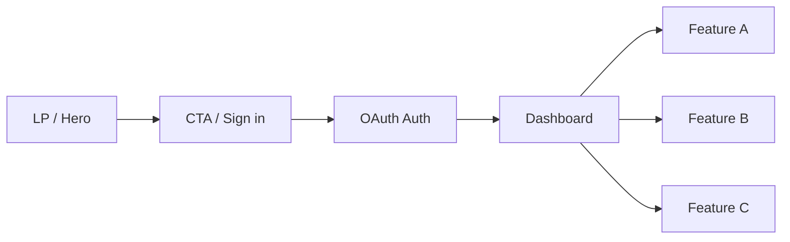

# LPプロット用・図生成プロンプト（Apple風ミニマル）

このドキュメントは、LP（ランディングページ）に使用する「プロットとなる図」や主要ビジュアルを生成するためのプロンプト集です。Apple公式サイトのような、白余白・整然・高品位なプロダクトフォトグラフィー/CGスタイルを前提にしています。

---

## 共通スタイル指示（全プロンプトに付与）

- トーン: Apple公式の製品LP風、超ミニマル、洗練、上質、静謐、クリーン、ハイキー、余白重視
- 背景: ピュアホワイト〜オフホワイト、紙のような質感、ノイズ極小、ビネットなし
- 光: 柔らかい自然光、スタジオ拡散光、ハイキー、ソフトシャドウ、繊細な反射、鏡面は控えめ
- 素材: アルミ・ガラス・セラミックの上品な質感、エッジはラウンド過ぎない
- 配色: ホワイト/ライトグレー中心、アクセントに#0A84FF（控えめ）、文字は#111111相当
- レイアウト: 中央配置または黄金比/対称、グリッド整列、余白たっぷり、要素は少なく
- 文字: 画像内テキストは基本「なし」（見出しはHTMLで重ねる想定）
- 作風: フォトリアルなプロダクト写真 or 高品位CGレンダリング、ディテールは繊細
- 禁則: 派手なグラデ/過剰なドロップシャドウ/ビジーな装飾/カートゥーン感/絵文字/透かし
- 出力: 高解像度、ノイズ低、ジャギーなし、圧縮アーティファクトなし

（推奨アスペクト比例）
- ヒーロー: 16:9 または 2:1（PC向けヒーロー）
- 機能パネル: 3:2 または 4:3（横長サブセクション）
- ダッシュボードモック: 16:10（MacBookディスプレイ比率に近い）
- モバイルモック: 9:16（iPhone比率）

---

## セクション別・図の生成プロンプト

### 1) ヒーロー（キービジュアル）
目的: ファーストビューで世界観とUIの上質さを伝える主役画像。

プロンプト:
「Apple公式製品サイト風、真っ白な背景に豊かな余白、柔らかい拡散光。中央に最新の薄型ノートPC（MacBook風）とスマートフォン（iPhone風）を左右にバランスよく配置。両デバイス画面には『[アプリ名]』の洗練されたUIの一部を表示（実在ロゴやテキストは入れない）。素材はアルミとガラス、エッジは精密。影は柔らかく短め、反射は控えめ。配色はホワイト/ライトグレー中心、アクセントに#0A84FFを微量。超ミニマル、クリーン、フォトリアル、高解像度。」

バリエーション補助語句（必要に応じて追加）:
- 「わずかな環境反射」「製品の薄さを強調」「視差少なめの正面寄りアングル」「余白広め」

推奨パラメータ: 16:9 or 2:1, 高解像度

---

### 2) 機能セクション（3枚パネル）
目的: 主要価値/機能を3分割で直感的に。

パネルA（コア価値）プロンプト:
「極簡素な白背景に、ガラスとアルミの幾何学的ブロックを3つ、等間隔で浮かせて配置。各ブロックの表面に抽象化した『[アプリのコア価値]』を連想させるピクト的UI要素（線画/薄い面）を表示。整列、ソフトシャドウ、ノイズ極小、Apple風の静けさ。」

パネルB（Googleログインの容易さ）プロンプト:
「白背景、最小限のUI部品を並べた抽象的コンポジション。中央に丸角のシンプルなボタン形状（ロゴや文字は入れない）。周辺に安全・簡単・高速を示す極細のラインアイコンを控えめに。全体はApple風ミニマル、過度な色味は使わず、アクセントに#0A84FFを一点。」

パネルC（スピード/クラウド連携）プロンプト:
「白背景、薄いガラス板が階段状に重なり、右方向に流れるような構図。微細なモーションを感じるブラーは控えめ。クラウドを示す極細ラインの抽象アイコンを上部に小さく。清潔、静謐、Apple風。」

推奨パラメータ: 各 3:2 or 4:3, 高解像度

---

### 3) ダッシュボードUIモック（スクリーンショット風）
目的: 実際の利用イメージを上質に伝える。

プロンプト:
「白背景。薄いアルミ筐体のラップトップ（MacBook風）を正面やや上から。ディスプレイには『[アプリ名]』のダッシュボードUIを写実的に表示（実在フォント名やロゴは使わない）。UIは余白と整列を重視し、グレー階調と微細な罫線、控えめな#0A84FFアクセント。光は柔らかく、反射は最小限、Apple風のプロダクトフォト。高解像度。」

推奨パラメータ: 16:10, 高解像度

---

### 4) デバイス群モック（レスポンシブ感）
目的: PC/タブレット/スマホで美しく使えることを示す。

プロンプト:
「白背景。ラップトップ、タブレット、スマホの3デバイスを整然と斜めに並べ、画面には『[アプリ名]』の異なる主要画面を擬似表示（テキストは入れない）。素材はアルミとガラス、薄いソフトシャドウ、反射控えめ。Apple公式の製品群写真のような統一感と質感。」

推奨パラメータ: 16:9, 高解像度

---

### 5) セクション背景/ディバイダー（抽象）
目的: セクション間の切り替えに使う、極めて控えめな装飾。

プロンプト:
「純白背景上に、非常に薄いガラスプレートが重なる抽象構図。わずかなグラデーション、ソフトなシャドウ、ノイズ極小。装飾性はごく控えめで、Apple風ミニマル。」

推奨パラメータ: 2:1 or 16:9, 目立ちすぎない明度差

---

### 6) アイコンセット（線画）
目的: 機能説明や箇条書きの横に使うアイコン。

プロンプト:
「白背景、極細ラインの統一アイコンを6〜9種、等間隔グリッドで配置。テーマは『簡単』『安全』『高速』『クラウド』『履歴』『共有』『設定』など。ラインは均一、角は控えめにラウンド、塗りなし、Apple風の繊細な質感。」

推奨パラメータ: 正方形, 高解像度

---

### 7) 信頼・実績セクション用（抽象的ロゴ壁）
目的: プレス掲載/導入実績の“雰囲気”を、実在ロゴなしで演出。

プロンプト:
「白背景、グレー階調の抽象的な四角形/プレースホルダーを3〜5列で整列。ロゴは入れず、形状のみで“ロゴ壁”を連想させる。影は極薄、Apple風の静けさと秩序感。」

推奨パラメータ: 16:9, コントラスト弱め

---

### 8) CTAセクション（Googleでログイン導線の雰囲気）
目的: 「Googleでログイン」CTAを置くセクションの背景/雰囲気画像。

プロンプト:
「白背景の上に、丸角のシンプルなカードを中央配置。カードはごく薄いシャドウと淡いガラス質感。カード中央にはボタン相当の空白領域のみ（ロゴや文言は画像に入れない）。全体はApple風ミニマル、余白広め、アクセントに#0A84FFをほんの少し。」

推奨パラメータ: 3:1 or 16:9, 高解像度

---

### 9) サイト構成/ユーザーフロー図（プロット）
目的: LP→Googleログイン→ダッシュボード→主要機能の流れをひと目で可視化。

プロンプト:
「白背景、極細ラインのフローチャート。左から右に流れるシンプルなプロセス。ノードは丸角の白カード、シャドウは極薄。テキストは入れず、抽象記号のみで“流れ”を表現（実装時にHTMLでラベルを重ねる想定）。Apple風ミニマル、整列、余白広め。」

推奨ノード（画像内ラベルは不要・実装時に重ねる）:
- LP（ヒーロー）
- CTA（Sign in with Google）
- 認証（OAuth）
- ダッシュボード
- 主要機能A/B/C

補助（必要ならテキスト図を即席で用意するためのMermaidサンプル）:

---

## カラーパレット（参考）
- Base White: #FFFFFF
- Off White: #F9FAFB
- Light Gray: #E5E7EB
- Mid Gray: #9CA3AF
- Text Primary: #111827
- Accent Blue: #0A84FF

---

## ファイル命名規則（出力管理）
- hero_apple-minimal_{w}x{h}.png
- features_a_corevalue_{w}x{h}.png
- features_b_google-login_{w}x{h}.png
- features_c_speed-cloud_{w}x{h}.png
- dashboard_mock_{w}x{h}.png
- devices_responsive_{w}x{h}.png
- bg_divider_{w}x{h}.png
- icons_set_line_{w}x{h}.png
- trust_wall_placeholder_{w}x{h}.png
- cta_bg_card_{w}x{h}.png
- flow_site-plot_{w}x{h}.png

---

## 使い方メモ
- 画像内テキストや実在ロゴは入れず、文言はHTML/CSSで重ねて実装してください。
- ボタン（Sign in with Google）の外観は、実装時に公式ガイドライン/ライブラリに準拠して表現してください（画像には含めない）。
- まずはヒーロー/機能3枚/ダッシュボード/フロー図の4点を先に生成→LPのドラフトに配置→微調整。
